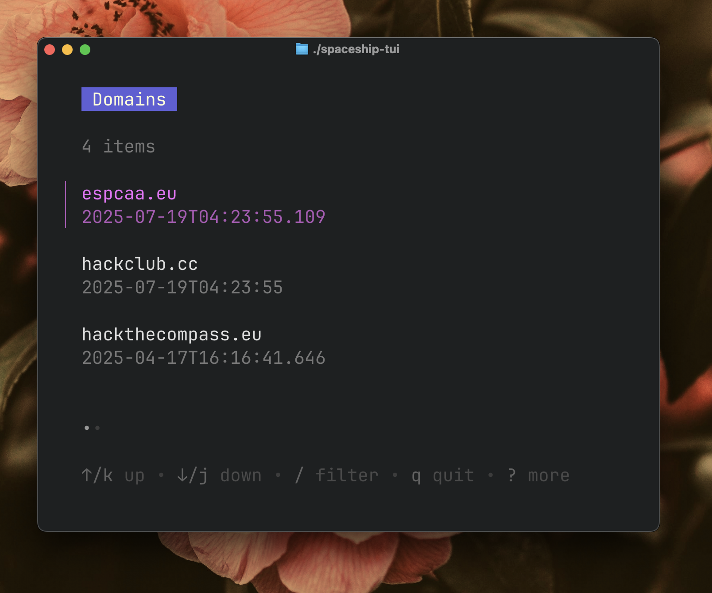

# Spaceship tui!

This is a small terminal user interface to view & modify dns records for spaceship domains! It was built using spaceship's API and bubbletea! (v2!)

## Installation

- run `go install github.com/espcaa/spaceship-tui@latest`
- make sure `~/go/bin` is in your PATH
- run it with `spaceship-tui`!
